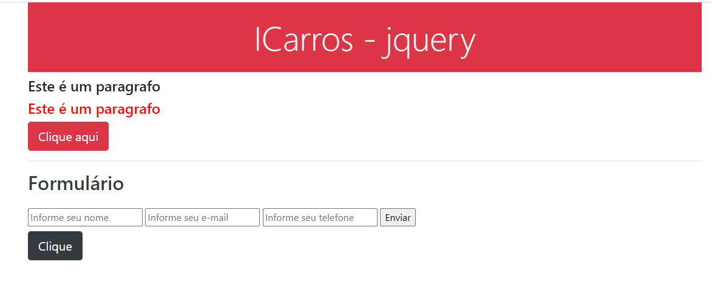

<h2>Projeto jQuery 💻</h2>

## Sobre

> Este projeto foi desenvolvido durante as aulas do curso **#AceleraiCarros_Tech**, oferecido pela Gama Academy. 

## Status 
👩🏻‍💻 Concluído.

## Recursos e Ferramentas 

* Git 
* Github 
* Visual Studio Code 
* Html 
* CSS 
* Bootstrap 
* JQuery

## Site
<a href="https://jquery-gama-tayane.netlify.app/" target="_blank">Link do Site</a>    

  

***"A persistência é o caminho do êxito"*** ✍️